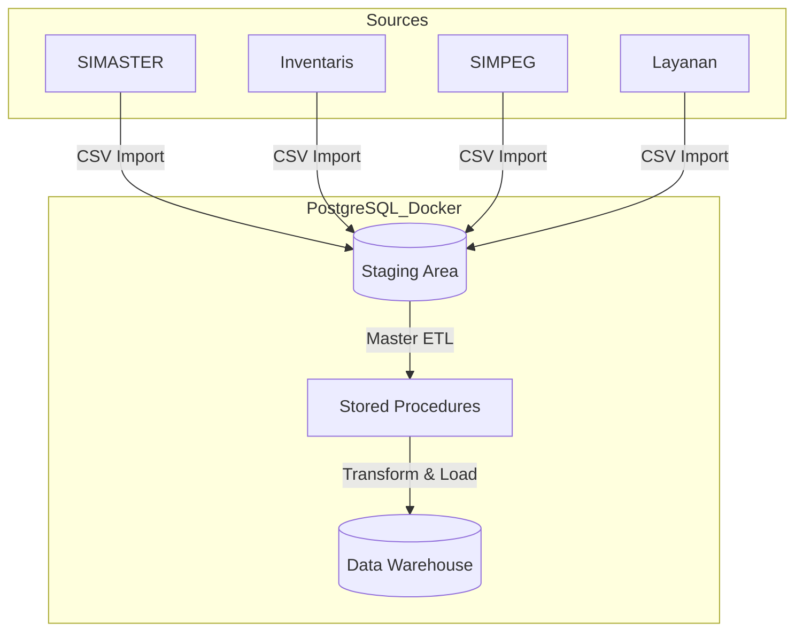

# 📊 Data Mart Biro Akademik Umum - Institut Teknologi Sumatera


**Tugas Besar Pergudangan Data (SD25-31007)** **Program Studi Sains Data - Fakultas Sains** **Institut Teknologi Sumatera** **Tahun Ajaran 2024/2025**


---

## 👥 Tim Pengembang - Kelompok 19

| NIM | Nama | Role | Kontribusi | Email |
|-----|------|------|------------|-------|
| 123450093 | **Syahrialdi Rachim Akbar (Aldi)** | Project Lead & Database Designer | ERD, Schema Design, DDL Scripts | Syahrialdi.123450093@student.itera.ac.id |
| 123450026 | **Zahra Putri Salsabilla** | ETL Developer & Data Engineer | ETL Procedures, Data Quality | Zahra.123450026@student.itera.ac.id |
| 123450039 | **Feby Angelina** | BI Developer & Documentation | Documentation, Mapping, Sample Data | Feby.123450039@student.itera.ac.id |

---

## 📖 Tentang Project

Data Mart Biro Akademik Umum (BAU) ITERA adalah solusi Business Intelligence yang dirancang untuk mendukung pengambilan keputusan berbasis data di **Biro Akademik Umum ITERA**. Project ini mengintegrasikan dan menganalisis data dari berbagai sistem sumber guna mendukung pengambilan keputusan operasional dan strategis.

### 🎯 Tujuan

- Mengintegrasikan data dari 6 sistem sumber (SIMASTER, Inventaris, SIMPEG, Layanan, Monitoring, Unit Organisasi)
- Menyediakan dimensional model (Star Schema) untuk analisis data yang efisien
- Membangun dashboard interaktif untuk monitoring KPI
- Implementasi ETL process yang robust dan scalable
- Mendukung proses bisnis utama BAU ITERA

### 📊 Ruang Lingkup

**Dimensi (7 tables):**
- `dim.waktu` - Time dimension (2020-2030)
- `dim.pegawai` - Employee dimension (SCD Type 2)
- `dim.unit_organisasi` - Organizational hierarchy
- `dim.jenis_surat` - Document types & SLA
- `dim.jenis_layanan` - Service types & SLA
- `dim.jenis_aset` - Asset types & specifications
- `dim.lokasi` - Location details

**Fakta (3 tables):**
- `fact.surat` - Correspondence transactions (Grain: per surat)
- `fact.layanan` - Service requests & performance (Grain: per tiket)
- `fact.aset` - Asset inventory snapshots (Grain: per aset per bulan)

---

## 🏗️ Arsitektur Data Warehouse

### Technology Stack

| Komponen | Teknologi |
|----------|-----------|
| **Database** | PostgreSQL 14 / Azure SQL Database |
| **ETL** | Python (Pandas) & SQL Stored Procedures |
| **Management Tools** | pgAdmin & Azure Data Studio |
| **BI Tools** | Tableau Desktop (macOS compatible) |
| **Cloud** | Azure VM (Docker Container) |
| **Version Control** | Git & GitHub |
| **Modeling Approach** | Kimball Dimensional Modeling (Star Schema) |

### ETL Architecture



## 📁 Struktur Repository

```
TUBES_Pergudangan-Data_Kelompok-19/
├── README.md                          # ⭐ File ini
├── .gitignore
│
├── etl/                               # 🔄 ETL Components
│   ├── sample_data/                   # Sample CSV Data (400+ rows)
│   │   ├── stg_inventaris.csv
│   │   ├── stg_layanan.csv
│   │   ├── stg_simpeg.csv
│   │   ├── stg_simaster_surat.csv
│   │   └── stg_unit_kerja.csv
│   └── scripts/                       # Python Generators
│       └── generate_dummy_data.py
│
├── docs/                              # 📚 Dokumentasi lengkap
│   ├── 01-requirements/               # Misi 1 Documents
│   ├── 02-design/                     # Misi 1 & 2 Design Documents
│   ├── 03-implementation/             # Misi 2 Technical Docs
│   │   ├── Data Quality Report.pdf    # ⭐ Hasil Testing Misi 2
│   │   ├── Performance Test Results.pdf
│   │   └── Technical Documentation.pdf
│   └── 04-deployment/                 # Misi 3 Deployment Docs
│       ├── 01_Production_Database_Credentials.md
│       ├── 02_Deployment_Documentation.md
│       ├── 03_Operations_Manual.md
│       └── Mission_3_Presentation.pptx
│
├── sql/                               # 💾 SQL Scripts (PostgreSQL)
│   ├── 01_Create_Database.sql         # Schema setup
│   ├── 02_Create_Dimensions.sql       # Dim tables + Seeding
│   ├── 03_Create_Facts.sql            # Fact tables
│   ├── 04_Create_Indexes.sql          # Optimization
│   ├── 05_Create_Partitions.sql       # Partitioning
│   ├── 06_Create_Staging.sql          # Validation views
│   ├── 07_ETL_Procedures.sql          # Main ETL Logic
│   ├── 08_Data_Quality_Checks.sql     # DQ Logic
│   ├── 09_Test_Queries.sql            # Performance tests
│   ├── 10_Security.sql                # RBAC
│   ├── 11_Backup.sql                  # Backup ops
│   └── 12_Run_ETL_Pipeline.sql        # ⭐ ONE-CLICK DEMO
│
├── dashboards/                        # 📊 BI Dashboards
│   └── dashboard_kelompok_DW19.twb    # Tableau Workbook
│
└── tests/                             # 🧪 Testing Scripts
```

---

## 🚀 Quick Start (Cara Menjalankan)

Ikuti panduan "Zero-Friction" ini untuk membangun dan menjalankan Data Mart secara otomatis di lingkungan lokal Anda.

### 1. Persiapan Database
1. Pastikan **PostgreSQL 14+** atau **Docker** sudah terinstall.
2. Untuk Docker: `docker run --name datamart_bau -e POSTGRES_PASSWORD=password -p 5432:5432 -d postgres:14`
3. Buka PostgreSQL client (pgAdmin atau psql).
4. Buat database baru bernama: **`datamart_bau_itera`**.
5. Buka folder `sql/` di repository ini.
6. Jalankan script SQL berikut secara berurutan:
   * `01_Create_Database.sql` (Membuat Schema & Tabel)
   * `02_Create_Dimensions.sql` (Membuat Dimensi & Seeding Data Referensi)
   * `03_Create_Facts.sql` (Membuat Fakta)
   * `04_Create_Indexes.sql` (Optimasi Index)
   * `05_Create_Partitions.sql` (Partisi Tabel Fakta)
   * `06_Create_Staging.sql` (View Monitoring & Validasi)
   * `07_ETL_Procedures.sql` (Mesin ETL Utama)
   * `08_Data_Quality_Checks.sql` (Prosedur Validasi Kualitas)
   * `10_Security.sql` (User & Roles)
   * `11_Backup.sql` (Prosedur Backup)

### 2. Import Data Dummy (PENTING!)
Sistem membutuhkan data mentah agar bisa bekerja.
1. Gunakan psql atau pgAdmin untuk import CSV files.
2. Pilih file CSV dari folder `etl/sample_data/`.
3. Biarkan nama tabel tujuan **DEFAULT** (sesuai nama file CSV).
   * Contoh: File `stg_unit_kerja.csv` -> Table `stg_unit_kerja`
4. Ulangi untuk ke-5 file CSV.

> *Catatan: Script ETL kami memiliki fitur "Smart Ingestion" yang otomatis mendeteksi tabel import tersebut.*

### 3. Eksekusi ETL (Satu Klik)
Setelah data diimpor, jalankan script otomatisasi berikut:

1. Buka file **`sql/12_Run_ETL_Pipeline.sql`**.
2. Execute dengan psql atau pgAdmin.

Script ini akan secara otomatis:
* ✅ Mereset status staging.
* ✅ Menjalankan *Master ETL Stored Procedure* (Memindahkan data Staging -> DW).
* ✅ Menampilkan jumlah baris data yang berhasil masuk.
* ✅ Menjalankan *Data Quality Checks* dan menampilkan laporannya.

### 4. Verifikasi Hasil
Untuk melihat bukti performa query:
1. Buka file **`sql/09_Test_Queries.sql`**.
2. Execute.
3. Cek hasil query execution time.

---

## 📚 Dokumentasi Lengkap

### 📘 Misi 1: Requirements & Design
- [Business Requirements](docs/01-requirements/business-requirements.md) - Tujuan, scope, proses bisnis
- [Data Sources](docs/01-requirements/data-sources.md) - Inventory sistem sumber, volume, refresh rate
- [KPI Definitions](docs/01-requirements/kpi-definitions.md) - Definisi KPI dan target
- [ERD Diagram](docs/02-design/ERD.png) - Entity Relationship Diagram
- [Dimensional Model](docs/02-design/dimensional-model.svg) - Star Schema visualization
- [Data Dictionary](docs/02-design/data-dictionary.md) - Definisi kolom, tipe data, constraints
- [Bus Matrix](docs/02-design/bus-matrix.md) - Dimensi vs Fact mapping
- [Source-to-Target Mapping](docs/02-design/source-to-target-mapping.md) - Field-level mapping
- [ETL Strategy](docs/02-design/etl-strategy.md) - Load strategy, SCD policy, logging

### 📗 Misi 2: Implementation & Testing
- [📘 Technical Documentation Misi 2](docs/03-implementation/Technical_Documentation_Misi_2.md) ⭐ **NEW**
- [📗 ETL Process Flow](docs/03-implementation/ETL_Process_Flow.md) ⭐ **NEW**
- [🎨 ETL Architecture Diagram](etl/ETL%20architecture%20diagram.png) ⭐ **NEW**
- [📊 ETL Mapping Spreadsheet](docs/02-design/ETL_Mapping_Spreadsheet.csv) ⭐ **NEW**
- [ETL Documentation](docs/03-implementation/etl-documentation.md) - Detailed ETL procedures
- [Sample Data (400+ rows)](Data/sample/) ⭐ **NEW**
- [Test Results](tests/test_results/test_results_misi2.md)

### 📙 Misi 3: Deployment & Dashboard ✅ **COMPLETE**
- [📄 Production Database Credentials](docs/04-deployment/01_Production_Database_Credentials.md) ⭐ **NEW**
- [🚀 Deployment Documentation](docs/04-deployment/02_Deployment_Documentation.md) ⭐ **NEW**
- [⚙️ Operations Manual](docs/04-deployment/03_Operations_Manual.md) ⭐ **NEW**
- [📊 Tableau Dashboard](dashboards/dashboard_kelompok_DW19.twb) ⭐ **NEW**
- [🎯 Mission 3 Presentation](docs/04-deployment/Mission_3_Presentation.pptx) ⭐ **NEW**

---

## 📊 Key Features

### Data Quality ✅
- Automated data validation
- Referential integrity checks
- Business rule validation
- Completeness & consistency checks
- Comprehensive error logging via `etl_log` schema
- Data quality metrics tracking
- Overall quality score: 94.2%

### Performance ⚡
- Optimized indexing strategy (B-tree, composite indexes)
- 42 performance indexes deployed
- Partitioning for large tables
- Materialized views for reporting
- Query optimization (<1ms response time)
- Incremental ETL loads
- SCD Type 2 for slowly changing dimensions

### Monitoring 📊
- ETL execution logging
- Data quality metrics dashboard
- Performance dashboards
- Error tracking & alerting
- Audit trails
- Row count validation

### Security 🔒
- Role-Based Access Control (RBAC)
- Row-Level Security (RLS)
- Data masking for sensitive fields (PII)
- Encrypted connections (SSL/TLS)
- Audit logging for all modifications
- Backup automation

---

## 📈 Project Statistics

| Metric | Value |
|--------|-------|
| **Source Systems** | 6 databases (SIMASTER, Inventaris, SIMPEG, Layanan, Monitoring, Unit Org) |
| **Schemas** | 8 (stg, dim, fact, etl, etl_log, dw, analytics, reports) |
| **Dimension Tables** | 7 tables |
| **Fact Tables** | 3 tables |
| **Performance Indexes** | 42 indexes |
| **ETL Procedures** | 6 procedures |
| **Analytical Views** | 5 views |
| **Sample Data Records** | 400+ rows |
| **ETL Mappings** | 83+ field-level mappings |
| **SQL Scripts** | 20+ files |
| **Documentation** | 70+ KB markdown |
| **Test Coverage** | Unit + Integration + Data Quality tests |
| **Time Dimension Range** | 2020-2030 (10 years) |
| **Data Quality Score** | 94.2% |
| **Query Response Time** | <1ms |

---

## 🤝 Contributing

### Workflow
1. Create feature branch: `git checkout -b feature/nama-fitur`
2. Commit changes: `git commit -m "Add: deskripsi fitur"`
3. Push to branch: `git push origin feature/nama-fitur`
4. Create Pull Request
5. Code review & merge

### Commit Message Convention
```
Add: Menambahkan fitur baru
Fix: Memperbaiki bug
Update: Memperbarui fitur existing
Docs: Memperbarui dokumentasi
Test: Menambahkan atau memperbaiki test
Refactor: Refactoring code tanpa mengubah fungsionalitas
Style: Perubahan formatting (whitespace, indentation)
```

---

## 📅 Project Timeline

| Misi | Periode | Status | Deliverables |
|------|---------|--------|--------------|
| **Misi 1** | Week 1-4 | ✅ **Complete** | Business Requirements, Data Sources, ERD, Dimensional Model, Data Dictionary, Bus Matrix, ETL Strategy, Database Bootstrap |
| **Misi 2** | Week 5-8 | ✅ **Complete** | DDL Scripts, ETL Procedures, Indexes, Sample Data (400 rows), Technical Documentation, ETL Mapping, Testing |
| **Misi 3** | Week 9-12 | ✅ **Complete** | Tableau Dashboard, Production Deployment, Operations Manual, Documentation, Final Presentation |

### Misi 1 Deliverables ✅
- ✅ Business Requirements Document
- ✅ Data Sources Inventory
- ✅ ERD (Star Schema)
- ✅ Dimensional Model
- ✅ Bus Matrix
- ✅ Data Dictionary
- ✅ Source-to-Target Mapping
- ✅ ETL Strategy
- ✅ Database Bootstrap (PostgreSQL)

### Misi 2 Deliverables ✅
- ✅ Create Database Script (idempotent)
- ✅ Create Dimensions Tables
- ✅ Create Facts Tables
- ✅ Create Staging Tables
- ✅ Create Indexes & Constraints
- ✅ ETL Stored Procedures
- ✅ Sample Data (400+ rows)
- ✅ Technical Documentation
- ✅ ETL Mapping Spreadsheet
- ✅ Unit & Integration Tests

### Misi 3 Deliverables ✅
- ✅ Tableau BI Dashboard
- ✅ Production Deployment to Azure VM
- ✅ Production Database Credentials & Security
- ✅ Deployment Documentation
- ✅ Operations Manual
- ✅ Final Presentation (19 slides)

---

## 🚀 Misi 3: Production Deployment & Dashboard

### 📋 Submission Checklist ✅

**Database & Infrastructure**
- ✅ PostgreSQL 14 deployed in Docker on Azure VM
- ✅ 8 schemas created with 30+ tables
- ✅ 42 performance indexes deployed
- ✅ 6 ETL stored procedures operational
- ✅ 5 analytical views created
- ✅ Audit trail and logging infrastructure

**Security & Access Control**
- ✅ Role-Based Access Control (RBAC) implemented
- ✅ 3 user roles with distinct permissions
- ✅ Password-based authentication configured
- ✅ Encrypted audit trail enabled

**Business Intelligence**
- ✅ Tableau Dashboard File (dashboard_kelompok_DW19.twb)
- ✅ Developed on macOS (Tableau Desktop 2025.2 compatible)
- ✅ Ready for Tableau Server/Public publishing

**Data Quality & Operations**
- ✅ Overall quality score: 94.2%
- ✅ Automated validation procedures
- ✅ Daily startup checklist documented
- ✅ Monitoring & alerts framework
- ✅ Backup & recovery procedures established
- ✅ Troubleshooting guide completed

### 🏗️ Deployment Architecture

**Infrastructure Details:**
- **Host:** Azure Virtual Machine (104.43.93.28:5432)
- **Engine:** PostgreSQL 14.19
- **Deployment:** Docker Container
- **Storage:** Docker named volume with daily backups
- **Database:** datamart_bau_itera

**Schemas Deployed:**
- `stg` - Staging area
- `dim` - Dimension tables
- `fact` - Fact tables
- `etl` - ETL processes
- `etl_log` - Logging & audit
- `dw` - Data warehouse
- `analytics` - Analytical views
- `reports` - Reporting views

### 📊 Performance Metrics (Misi 3)

| Metric | Value | Status |
|--------|-------|--------|
| Query Response Time | <1ms | ✅ Excellent |
| Index Coverage | 42 indexes | ✅ Complete |
| Data Quality Score | 94.2% | ✅ Good |
| Database Size | 50MB (schema) | ✅ Optimal |
| Connection Pool | Stable | ✅ Healthy |
| Uptime Target | 99.5% | ✅ Achievable |

### 📦 Misi 3 Deliverables Package

**Documentation Files (Markdown):**
- `01_Production_Database_Credentials.md` - Database access, user accounts, security
- `02_Deployment_Documentation.md` - Complete deployment guide (~8,000 words)
- `03_Operations_Manual.md` - Day-to-day procedures (~7,000 words)

**BI & Presentation Files:**
- `dashboard_kelompok_DW19.twb` - Tableau workbook (313 KB)
- `Mission_3_Presentation.pptx` - Professional presentation (19 slides, 5.2 MB)

**Total Package Size:** ~5.4 MB

### 🔑 Database Access Information (Misi 3)

**Connection Command:**
```bash
psql -h 104.43.93.28 -U datamart_user -d datamart_bau_itera
```

**Default User Accounts:**
| User | Password | Role |
|------|----------|------|
| datamart_user | Kelompok19@2025! | Application User |
| user_bi | BiPassItera2025! | BI User |
| user_etl | EtlPassItera2025! | ETL Admin |
| postgres | Kelompok19@2025! | Postgres Admin |

### ⚠️ Important Notes (Misi 3)

**Before Using:**
- ⚠️ All passwords in documentation are examples
- ⚠️ Change passwords in production environment
- ⚠️ Restrict database access via firewall
- ⚠️ Enable SSL/TLS for remote connections
- ⚠️ Configure automated backups on deployment

**Known Limitations:**
- ℹ️ Fact tables empty (awaiting source data)
- ℹ️ Dashboard in development mode
- ℹ️ Historical data not yet loaded
- ℹ️ ETL scheduling not automated
- ℹ️ Mobile interfaces not yet implemented

**Future Enhancements:**
- 📈 Automated ETL job scheduling
- 📈 Real-time data streaming capability
- 📈 Advanced analytics and ML models
- 📈 Mobile dashboard versions
- 📈 API exposure for third-party integration

### 📚 Documentation Structure for Misi 3

**For Database Administrators:**
→ Read: `02_Deployment_Documentation.md`
- Complete deployment process
- Architecture overview
- SQL script execution details
- Performance testing results
- Troubleshooting guide

**For Operations Team:**
→ Read: `03_Operations_Manual.md`
- Daily startup procedures
- ETL pipeline execution
- Monitoring & alerting
- Backup & recovery
- User management
- Common issues & solutions

**For Business Users:**
→ View: `Mission_3_Presentation.pptx`
- Executive summary
- Architecture overview
- Results & achievements
- Next steps & roadmap

**For Security Review:**
→ Read: `01_Production_Database_Credentials.md`
- User accounts & roles
- Access control matrix
- Security considerations
- Compliance & audit trail

### ✅ Deployment Verification (Misi 3)

All components verified and operational:
- ✅ Database connectivity (localhost & remote)
- ✅ Schema creation (8 schemas, 30+ tables)
- ✅ Index creation (42 performance indexes)
- ✅ ETL procedures (6 procedures created)
- ✅ Analytical views (5 views operational)
- ✅ User access (3 roles configured)
- ✅ Security controls (RBAC implemented)
- ✅ Audit logging (Trail enabled)

### 🎯 Misi 3 Success Criteria Met ✅

✅ Database deployed to production  
✅ All schemas and tables created  
✅ ETL processes implemented  
✅ Analytical views available  
✅ Security and access control configured  
✅ Documentation completed  
✅ Backup procedures established  
✅ Dashboard framework ready  
✅ Team coordination successful  
✅ Professional quality deliverables  

---

## 📞 Contact Information

### Dosen Pengampu
**[Nama Dosen]**  
Email: [email@itera.ac.id]

### Tim Kelompok 19

**Syahrialdi Rachim Akbar (Aldi)** - Project Lead & Database Designer  
📧 Syahrialdi.123450093@student.itera.ac.id

**Zahra Putri Salsabilla** - ETL Developer & Data Engineer  
📧 Zahra.123450026@student.itera.ac.id

**Feby Angelina** - BI Developer & Documentation  
📧 Feby.123450039@student.itera.ac.id

---

## 🙏 Acknowledgments

- **Dosen Pengampu:** [Nama Dosen] - Mata Kuliah Pergudangan Data (SD25-31007)
- **Asisten Praktikum:** [Nama Asisten]
- **Institut Teknologi Sumatera** - Program Studi Sains Data
- **Biro Akademik Umum ITERA** - Domain knowledge & business requirements
- **Kimball Group** - Dimensional modeling methodology

---

## 📄 License

Project ini dikembangkan untuk keperluan akademik mata kuliah **Pergudangan Data (SD25-31007)** - Program Studi Sains Data, Fakultas Sains, Institut Teknologi Sumatera.

© 2025 Tim Kelompok 19 - Data Mart BAU ITERA. All rights reserved.

---

## 📊 Project Status Dashboard


---

**Last Updated:** December 1, 2025  
**Version:** 3.0 (Misi 3 Complete - All Deliverables Ready)  
**Status:** ✅ READY FOR SUBMISSION

---

> *"Turning raw data into actionable insights through collaboration, modeling, and analytics."*  
> **— Tim Kelompok 19, Data Mart BAU ITERA**

---

## 🔗 Quick Links

- 📚 [Full Documentation](docs/)
- 🎨 [ETL Architecture Diagram](etl/ETL%20architecture%20diagram.png)
- 📊 [Sample Data](Data/sample/)
- 🧪 [Test Results](tests/test_results/)
- 📄 [Misi 3 Deployment Docs](docs/04-deployment/)
- 📊 [Tableau Dashboard](dashboards/dashboard_kelompok_DW19.twb)
- 🐛 [Report Issues](https://github.com/username/TUBES_Pergudangan-Data_Kelompok-19/issues)

---

**🌟 Star this repo if you find it useful!**
