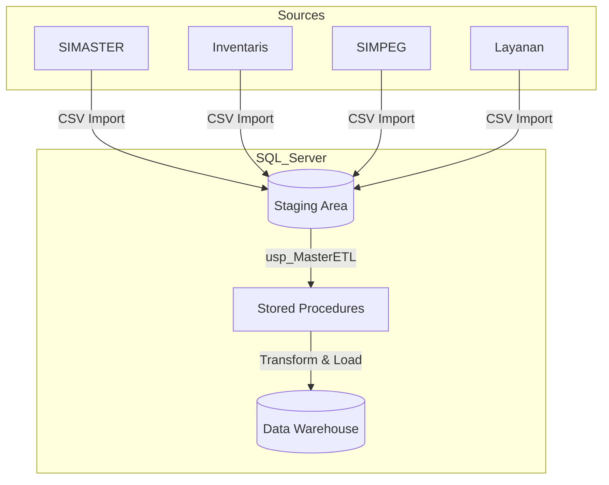

# 📊 Data Mart Biro Akademik Umum - Institut Teknologi Sumatera


**Tugas Besar Pergudangan Data (SD25-31007)** **Program Studi Sains Data - Fakultas Sains** **Institut Teknologi Sumatera** **Tahun Ajaran 2024/2025**


---

## 👥 Tim Pengembang - Kelompok 19

| NIM | Nama | Role | Kontribusi | Email |
|-----|------|------|------------|-------|
| 123450093 | **Syahrialdi Rachim Akbar** | Project Lead & Database Designer | ERD, Schema Design, DDL Scripts | Syahrialdi.123450093@student.itera.ac.id |
| 123450026 | **Zahra Putri Salsabilla** | ETL Developer & Data Engineer | ETL Procedures, Data Quality | Zahra.123450026@student.itera.ac.id |
| 123450039 | **Feby Angelina** | BI Developer & Documentation | Documentation, Mapping, Sample Data | Feby.123450039@student.itera.ac.id |

---

## 📖 Tentang Project

Data Mart Biro Akademik Umum (BAU) ITERA adalah solusi Business Intelligence yang dirancang untuk mendukung pengambilan keputusan berbasis data di **Biro Akademik Umum ITERA**. Project ini mengintegrasikan dan menganalisis data dari berbagai sistem sumber guna mendukung pengambilan keputusan operasional dan strategis.

### 🎯 Tujuan

- Mengintegrasikan data dari 6 sistem sumber (SIMASTER, Inventaris, SIMPEG, Layanan, Monitoring, Unit Organisasi)
- Menyediakan dimensional model (Star Schema) untuk analisis data yang efisien
- Membangun dashboard interaktif untuk monitoring KPI
- Implementasi ETL process yang robust dan scalable
- Mendukung proses bisnis utama BAU ITERA

### 📊 Ruang Lingkup

**Dimensi (7 tables):**
- `dim.waktu` - Time dimension (2020-2030)
- `dim.pegawai` - Employee dimension (SCD Type 2)
- `dim.unit_organisasi` - Organizational hierarchy
- `dim.jenis_surat` - Document types & SLA
- `dim.jenis_layanan` - Service types & SLA
- `dim.jenis_aset` - Asset types & specifications
- `dim.lokasi` - Location details

**Fakta (3 tables):**
- `fact.surat` - Correspondence transactions (Grain: per surat)
- `fact.layanan` - Service requests & performance (Grain: per tiket)
- `fact.aset` - Asset inventory snapshots (Grain: per aset per bulan)

---

## 🏗️ Arsitektur Data Warehouse

### Technology Stack

| Komponen | Teknologi |
|----------|-----------|
| **Database** | Microsoft SQL Server 2019 / Azure SQL Database |
| **ETL** | Python (Pandas) & T-SQL Stored Procedures |
| **Management Tools** | SSMS & Azure Data Studio |
| **BI Tools** | Power BI Desktop |
| **Cloud** | Azure VM (Windows/Linux) |
| **Version Control** | Git & GitHub |
| **Modeling Approach** | Kimball Dimensional Modeling (Star Schema) |

### ETL Architecture



## 📁 Struktur Repository

```
TUBES_Pergudangan-Data_Kelompok-19/
├── README.md                          # ⭐ File ini
├── .gitignore
│
├── etl/                               # 🔄 ETL Components
│   ├── sample_data/                   # Sample CSV Data (400+ rows)
│   │   ├── stg_inventaris.csv
│   │   ├── stg_layanan.csv
│   │   ├── stg_simpeg.csv
│   │   ├── stg_simaster_surat.csv
│   │   └── stg_unit_kerja.csv
│   └── scripts/                       # Python Generators
│       └── generate_dummy_data.py
│
├── docs/                              # 📚 Dokumentasi lengkap
│   ├── 01-requirements/               # Misi 1 Documents
│   ├── 02-design/                     # Misi 1 & 2 Design Documents
│   └── 03-implementation/             # Misi 2 Technical Docs
│       ├── Data Quality Report.pdf    # ⭐ Hasil Testing Misi 2
│       ├── Performance Test Results.pdf
│       └── Technical Documentation.pdf
│
├── sql/                               # 💾 SQL Scripts (T-SQL)
│   ├── 01_Create_Database.sql         # Schema setup
│   ├── 02_Create_Dimensions.sql       # Dim tables + Seeding
│   ├── 03_Create_Facts.sql            # Fact tables
│   ├── 04_Create_Indexes.sql          # Optimization
│   ├── 05_Create_Partitions.sql       # Partitioning
│   ├── 06_Create_Staging.sql          # Validation views
│   ├── 07_ETL_Procedures.sql          # Main ETL Logic
│   ├── 08_Data_Quality_Checks.sql     # DQ Logic
│   ├── 09_Test_Queries.sql            # Performance tests
│   ├── 10_Security.sql                # RBAC
│   ├── 11_Backup.sql                  # Backup ops
│   └── 12_Run_ETL_Pipeline.sql        # ⭐ ONE-CLICK DEMO
│
└── tests/                             # 🧪 Testing Scripts
```

---

## 🚀 Quick Start (Cara Menjalankan)

Ikuti panduan "Zero-Friction" ini untuk membangun dan menjalankan Data Mart secara otomatis di lingkungan lokal Anda.

### 1. Persiapan Database
1.  Pastikan **SQL Server 2019+** dan **SSMS** (atau Azure Data Studio) sudah terinstall.
2.  Buka SSMS dan buat database baru bernama: **`datamart_bau_itera`**.
3.  Buka folder `sql/` di repository ini.
4.  Jalankan script SQL berikut secara berurutan (Tekan F5):
    * `01_Create_Database.sql` (Membuat Schema & Tabel)
    * `02_Create_Dimensions.sql` (Membuat Dimensi & Seeding Data Referensi)
    * `03_Create_Facts.sql` (Membuat Fakta)
    * `04_Create_Indexes.sql` (Optimasi Index)
    * `05_Create_Partitions.sql` (Partisi Tabel Fakta)
    * `06_Create_Staging.sql` (View Monitoring & Validasi)
    * `07_ETL_Procedures.sql` (Mesin ETL Utama)
    * `08_Data_Quality_Checks.sql` (Prosedur Validasi Kualitas)
    * `10_Security.sql` (User & Roles)
    * `11_Backup.sql` (Prosedur Backup)

### 2. Import Data Dummy (PENTING!)
Sistem membutuhkan data mentah agar bisa bekerja.
1.  Di SSMS, Klik Kanan Database `datamart_bau_itera` > **Tasks** > **Import Flat File...**
2.  Pilih file CSV dari folder `etl/sample_data/`.
3.  **PENTING:** Biarkan nama tabel tujuan **DEFAULT** (sesuai nama file CSV) dan schema **dbo**.
    * Contoh: File `stg_unit_kerja.csv` -> Table `dbo.stg_unit_kerja`
4.  Klik **Next** > **Finish**.
5.  Ulangi untuk ke-5 file CSV.

> *Catatan: Script ETL kami memiliki fitur "Smart Ingestion" yang otomatis mendeteksi tabel import tersebut.*

### 3. Eksekusi ETL (Satu Klik)
Setelah data diimpor, jalankan script otomatisasi berikut:

1.  Buka file **`sql/12_Run_ETL_Pipeline.sql`**.
2.  Tekan **Execute (F5)**.

Script ini akan secara otomatis:
* ✅ Mereset status staging.
* ✅ Menjalankan *Master ETL Stored Procedure* (Memindahkan data Staging -> DW).
* ✅ Menampilkan jumlah baris data yang berhasil masuk.
* ✅ Menjalankan *Data Quality Checks* dan menampilkan laporannya.

### 4. Verifikasi Hasil
Untuk melihat bukti performa query:
1.  Buka file **`sql/09_Test_Queries.sql`**.
2.  Jalankan (F5).
3.  Cek tab **Messages** untuk melihat waktu eksekusi (`CPU time` & `Elapsed time`).
---

## 📚 Dokumentasi Lengkap

### 📘 Misi 1: Requirements & Design
- [Business Requirements](docs/01-requirements/business-requirements.md) - Tujuan, scope, proses bisnis
- [Data Sources](docs/01-requirements/data-sources.md) - Inventory sistem sumber, volume, refresh rate
- [KPI Definitions](docs/01-requirements/kpi-definitions.md) - Definisi KPI dan target
- [ERD Diagram](docs/02-design/ERD.png) - Entity Relationship Diagram
- [Dimensional Model](docs/02-design/dimensional-model.svg) - Star Schema visualization
- [Data Dictionary](docs/02-design/data-dictionary.md) - Definisi kolom, tipe data, constraints
- [Bus Matrix](docs/02-design/bus-matrix.md) - Dimensi vs Fact mapping
- [Source-to-Target Mapping](docs/02-design/source-to-target-mapping.md) - Field-level mapping
- [ETL Strategy](docs/02-design/etl-strategy.md) - Load strategy, SCD policy, logging

### 📗 Misi 2: Implementation & Testing
- [📘 Technical Documentation Misi 2](docs/03-implementation/Technical_Documentation_Misi_2.md) ⭐ **NEW**
- [📗 ETL Process Flow](docs/03-implementation/ETL_Process_Flow.md) ⭐ **NEW**
- [🎨 ETL Architecture Diagram](etl/ETL%20architecture%20diagram.png) ⭐ **NEW**
- [📊 ETL Mapping Spreadsheet](docs/02-design/ETL_Mapping_Spreadsheet.csv) ⭐ **NEW**
- [ETL Documentation](docs/03-implementation/etl-documentation.md) - Detailed ETL procedures
- [Sample Data (400+ rows)](Data/sample/) ⭐ **NEW**
- [Test Results](tests/test_results/test_results_misi2.md)

### 📙 Misi 3: Deployment & Dashboard (Coming Soon)
- [Deployment Guide](docs/04-deployment/deployment-guide.md)
- [Operations Manual](docs/04-deployment/operations-manual.md)
- [User Manual](docs/04-deployment/user-manual.md)
- [Dashboard Screenshots](dashboards/screenshots/)

---

## 📊 Key Features

### Data Quality ✅
- Automated data validation
- Referential integrity checks
- Business rule validation
- Completeness & consistency checks
- Comprehensive error logging via `etl_log` schema
- Data quality metrics tracking

### Performance ⚡
- Optimized indexing strategy (B-tree, composite indexes)
- Partitioning for large tables
- Materialized views for reporting
- Query optimization
- Incremental ETL loads
- SCD Type 2 for slowly changing dimensions

### Monitoring 📊
- ETL execution logging (`etl_log.job_execution`)
- Data quality metrics (`etl_log.data_quality_log`)
- Performance dashboards
- Error tracking & alerting
- Audit trails (`etl_log.audit_log`)
- Row count validation

### Security 🔒
- Role-Based Access Control (RBAC)
- Row-Level Security (RLS)
- Data masking for sensitive fields (PII)
- Encrypted connections (SSL/TLS)
- Audit logging for all modifications
- Backup automation

---

## 📈 Project Statistics

| Metric | Value |
|--------|-------|
| **Source Systems** | 6 databases (SIMASTER, Inventaris, SIMPEG, Layanan, Monitoring, Unit Org) |
| **Schemas** | 5 (stg, dim, fact, etl_log, dw) |
| **Dimension Tables** | 7 tables |
| **Fact Tables** | 3 tables |
| **Sample Data Records** | 400+ rows |
| **ETL Mappings** | 83+ field-level mappings |
| **SQL Scripts** | 20+ files |
| **Documentation** | 70+ KB markdown |
| **Test Coverage** | Unit + Integration + Data Quality tests |
| **Time Dimension Range** | 2020-2030 (10 years) |

---

## 🤝 Contributing

### Workflow
1. Create feature branch: `git checkout -b feature/nama-fitur`
2. Commit changes: `git commit -m "Add: deskripsi fitur"`
3. Push to branch: `git push origin feature/nama-fitur`
4. Create Pull Request
5. Code review & merge

### Commit Message Convention
```
Add: Menambahkan fitur baru
Fix: Memperbaiki bug
Update: Memperbarui fitur existing
Docs: Memperbarui dokumentasi
Test: Menambahkan atau memperbaiki test
Refactor: Refactoring code tanpa mengubah fungsionalitas
Style: Perubahan formatting (whitespace, indentation)
```

---

## 📅 Project Timeline

| Misi | Periode | Status | Deliverables |
|------|---------|--------|--------------|
| **Misi 1** | Week 1-4 | ✅ **Complete** | Business Requirements, Data Sources, ERD, Dimensional Model, Data Dictionary, Bus Matrix, ETL Strategy, Database Bootstrap |
| **Misi 2** | Week 5-8 | ✅ **Complete** | DDL Scripts, ETL Procedures, Indexes, Sample Data (400 rows), Technical Documentation, ETL Mapping, Testing |
| **Misi 3** | Week 9-12 | 🔄 **In Progress** | Dashboard Power BI, Deployment, User Manual, Operations Manual, Final Presentation |

### Misi 1 Deliverables ✅
- ✅ Business Requirements Document
- ✅ Data Sources Inventory
- ✅ ERD (Star Schema)
- ✅ Dimensional Model
- ✅ Bus Matrix
- ✅ Data Dictionary
- ✅ Source-to-Target Mapping
- ✅ ETL Strategy
- ✅ Database Bootstrap (PostgreSQL)

### Misi 2 Deliverables ✅
- ✅ Create Database Script (idempotent)
- ✅ Create Dimensions Tables
- ✅ Create Facts Tables
- ✅ Create Staging Tables
- ✅ Create Indexes & Constraints
- ✅ ETL Stored Procedures
- ✅ Sample Data (400+ rows)
- ✅ Technical Documentation
- ✅ ETL Mapping Spreadsheet
- ✅ Unit & Integration Tests

### Misi 3 Deliverables 🔄
- 🔄 Power BI Dashboard (Executive, Operational, Custom Reports)
- 🔄 Deployment to Production
- 🔄 User Manual
- 🔄 Operations Manual
- 🔄 Final Presentation

---

## 📞 Contact Information

### Dosen Pengampu
**[Nama Dosen]**  
Email: [email@itera.ac.id]

### Tim Kelompok 19

**Syahrialdi Rachim Akbar (Aldi)** - Project Lead & Database Designer  
📧 Syahrialdi.123450093@student.itera.ac.id

**Zahra Putri Salsabilla** - ETL Developer & Data Engineer  
📧 Zahra.123450026@student.itera.ac.id

**Feby Angelina (Aya)** - BI Developer & Documentation  
📧 Feby.123450039@student.itera.ac.id

---

## 🙏 Acknowledgments

- **Dosen Pengampu:** [Nama Dosen] - Mata Kuliah Pergudangan Data (SD25-31007)
- **Asisten Praktikum:** [Nama Asisten]
- **Institut Teknologi Sumatera** - Program Studi Sains Data
- **Biro Akademik Umum ITERA** - Domain knowledge & business requirements
- **Kimball Group** - Dimensional modeling methodology

---

## 📄 License

Project ini dikembangkan untuk keperluan akademik mata kuliah **Pergudangan Data (SD25-31007)** - Program Studi Sains Data, Fakultas Sains, Institut Teknologi Sumatera.

© 2025 Tim Kelompok 19 - Data Mart BAU ITERA. All rights reserved.

---

## 📊 Project Status Dashboard


---

**Last Updated:** 24 November 2025  
**Version:** 2.0 (Misi 2 Complete - Ready for Misi 3)  
**Next Milestone:** Power BI Dashboard & Deployment

---

> *"Turning raw data into actionable insights through collaboration, modeling, and analytics."*  
> **— Tim Kelompok 19, Data Mart BAU ITERA**

---

## 🔗 Quick Links

- 📚 [Full Documentation](docs/)
- 🎨 [ETL Architecture Diagram](etl/ETL%20architecture%20diagram.png)
- 📊 [Sample Data](Data/sample/)
- 🧪 [Test Results](tests/test_results/)
- 🐛 [Report Issues](https://github.com/username/TUBES_Pergudangan-Data_Kelompok-19/issues)

---

**🌟 Star this repo if you find it useful!**
